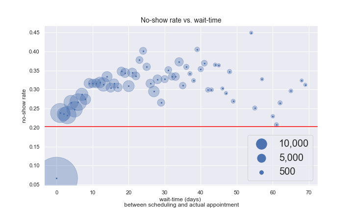
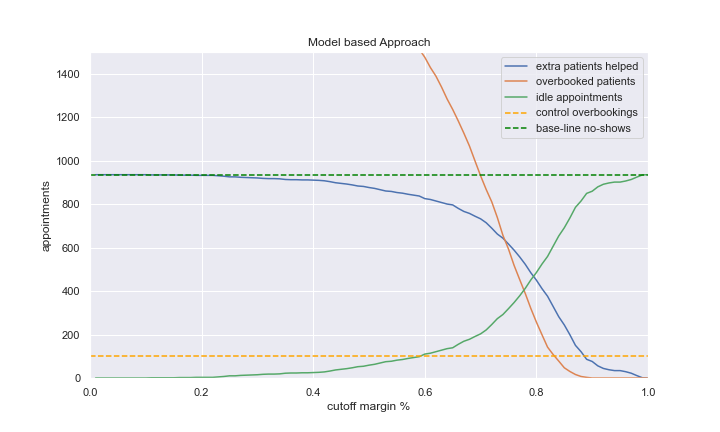

Medical Appointment No Shows
==============================

**Objective:** understand if a patient is coming to his doctors appointment, and use this to recommend strategic actions to increase the number of patients showing up.

**General process:** 
The business challenge and data comes from [Kaggle's Medical Appointment No Shows](https://www.kaggle.com/joniarroba/noshowappointments) dataset, containing data on doctor appointments at a clinic in Brazil in May-2016. After extracting and cleaning this data, we perform an extensive EDA during which generate additional features. These features are used to train a Random Forest Model to predict wether or not a patient is expected to show-up, after which this model is evaluates using Partial Dependence Plots. 

Conclusion
------------
We've found that the wait-time between scheduling the appointment and the actual appointment, the patient's age and wether or not the patient showed up for his last appointment are key indicators for no_shows. The reminder SMS does work, but not as much as expected. In addition it's only send to a select group of user (with longer wait-times).

More insights into to gathering of data would help improve our assessment (i.e. are the duplicates caused by cancellations or updates of appointments), as would gathering data over a longer period of time.

We also propose an application of our predictive model to allow for dynamic overbooking of appointments and show that this approach can reduce idle-time (missed appointment) by 30%. 

More info in notebook 4, section 5.

Outlook (WIP)
------------
We've optimised our model for capturing the patterns in the data (optimising F1 score and AUC), however, this does reduce our Precision (and accuracy), which shows in the application of the predictive model.

A next iteration would be to create a (second) model, taking into account the restrictions with regards to over-booking appointments (max 100 False Positives) and optimised the reduction of missed appointments.

Recommended setup
------------
To get the best experience viewing the jupyter notebooks, I advice to use **jupyter labs**, with the *table-of-contents* (toc) extension. 

Project Organization
------------

    ├── README.md          
    ├── data                 <- All data-files, raw & various stages of processing.
    │
    ├── models               <- notebooks to process data, perform the EDA and generate the report
    │
    ├── src                  <- Common used functions to evaluate models
    │
    ├── requirements.txt     <- The requirements file for reproducing the analysis environment, e.g.
    │                           generated with `pip freeze > requirements.txt`
    │
    └── <notebooks>          <- jupyter notebooks covering data wrangling, EDA, modelling and evaluation

--------